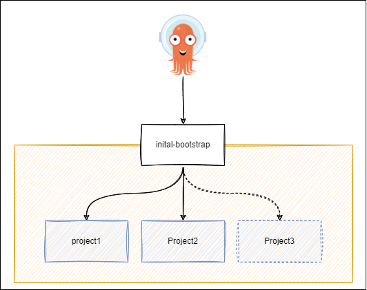
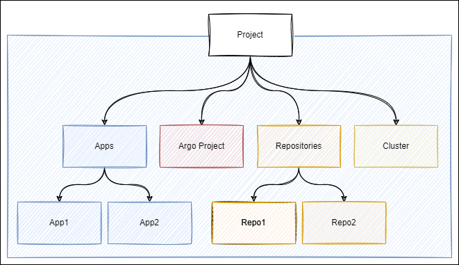

# Devops-ArgoCD

## ArgoCD deployment

ArgoCD is handled by helm. Values are specified inside the `argocd` folder.

## ArgoCD Applications

### App Of Apps Pattern

Projects are created via the `charts/bootstrap` folder.
You just need to update the `values.yaml` file to add (or update) a new project (under the `application` key) and refer to a "value file" inside the `charts/project` folder. (see below)

### Project

A project is compond by :
- Project definition
- Repository/ies
- Application(s)
- Cluster

The definition will be done in a specific values.yaml file referenced in the bootstrap app (see previous chapter)
